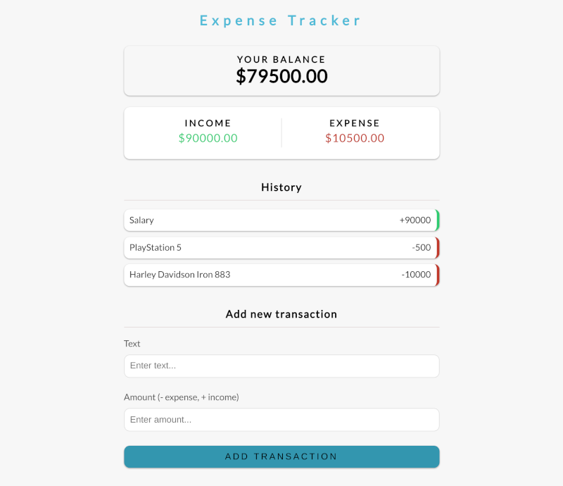

# Expense Tracker (MERN / Vanilla JS)

> Full stack expense tracker + Vanilla JS version

<h2 align="center">
  
  <br>
</h2>


## Usage (MERN)

change config.env file in config folder
```
NODE_ENV=production
PORT=5000
MONGO_URI=YOUR_DATABASE_URI
```
### Installation

```bash
 npm install
 cd client 
 npm install
 cd ..
 
 # Run front and backend
 npm run dev
 
 # Backend only
 npm run server
 
 # Frontend only
 npm run client
 
 # Build client
 cd client
 npm run build
 
 # Prod
 npm start
```
## Usage (Vanilla JS)

You can find related files in the expense-tracker-vanilla-js folder and run the html document in your local server. (e.g. VSCode Live Server). In this version, Local Storage is used instead of Node.js server.